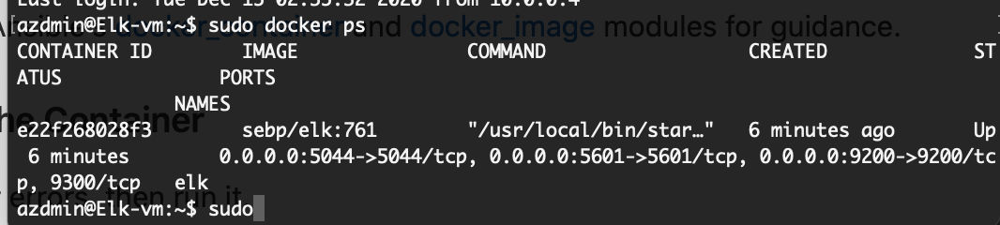

## Automated ELK Stack Deployment

The files in this repository were used to configure the network depicted below.

These files have been tested and used to generate a live ELK deployment on Azure. They can be used to either recreate the entire deployment pictured above. Alternatively, select portions of the playbook (.yml)file may be used to install only certain pieces of it, such as Filebeat.

Below are the required playbooks: 

  - [my-playbook.yml](Ansible/my-playbook.yml) To install DVWA servers
  - [filebeat-playbook.yml](Ansible/filebeat-playbook.yml) To install/configure Filebeat on DVWA servers and ELK
  - [metricbeat-playbook.yml](Ansible/metricbeat-playbook.yml) To install/configure Metricbeat on DVWA servers and ELK

This document contains the following details:
- Description of the Topologu
- Access Policies
- ELK Configuration
  - Beats in Use
  - Machines Being Monitored
- How to Use the Ansible Build

### Description of the Topology

The main purpose of this network is to expose a load-balanced and monitored instance of DVWA, the D*mn Vulnerable Web Application.

Load balancing ensures that the application will be highly available, in addition to restricting access to the network. Furthermore, it effectively distributes incoming traffic across multiple servers thus, ensuring availability to web-servers.Load balancer adds additional layer(s) of security to a network/website. It can protect from emerging threats, DDoS attacks and protection against unauthorized access. 

What is the advantage of a jump box?
The main advantage for a jump box is that it can be considered as an originating or starting point for any administrative related tasks. In this particular scenario, jump box is considered as a admin work station which allows full connectivity to other VM's on the network. It is absolute necessary to first get access to jump box in order to gain access to other VM's

Integrating an ELK server allows users to easily monitor the vulnerable VMs for changes to the logs and system traffic.
- Filebeats monitors log directories and log files
- Metricbeat collects statistics and metrics from the system and the services running

The configuration details of each machine may be found below.
_Note: Use the [Markdown Table Generator](http://www.tablesgenerator.com/markdown_tables) to add/remove values from the table_.

| Name     | Function | IP Address | Operating System |
|----------|----------|------------|------------------|
| Jump Box | Gateway  | 10.0.0.4   | Linux            |
| web-1    | Web server -DVWA         | 10.0.0.5   | Linux            |
| web-3    | Web Server -DVWA         | 10.0.1.4   | Linux            |
| ELK-vm   | ELK Stack	         | 10.2.0.4   | Linux            |

### Access Policies

The machines on the internal network are not exposed to the public Internet. 

Only the Jump-Box Provisioner machine can accept connections from the Internet. Access to this machine is only allowed from the following IP addresses:
-  Personal IP Address

Machines within the network can only be accessed by SSH.
- The Elk-vm can be access by SSH from the Jump-Box-vm and through Personal IP Address

A summary of the access policies in place can be found in the table below.

| Name     | Publicly Accessible | Allowed IP Addresses |
|----------|---------------------|----------------------|
| Jump Box | Yes                 | Personal IP Address  |
| Web-1    | No                  |  10.0.0.5            |
| Web-3    | No                  |  10.0.1.4            |
| ELK-VM   | No                  |  10.2.0.4            |
	
### Elk Configuration

Ansible was used to automate configuration of the ELK machine. No configuration was performed manually, which is advantageous because it can help organize and deploy multiple servers faster and easily without any hassle.

The playbook implements the following tasks:
- Install Docker.io (and pip3)
- Increase memory for virtual machines
- Sysctl module
- Download/config docker containers(ELK, in this case)
- Set up Ports

The following screenshot displays the result of running `docker ps` after successfully configuring the ELK instance.

### Target Machines & Beats
This ELK server is configured to monitor the following machines:
- Web-1 10.0.0.5   
- Web-2 10.0.1.4   

We have installed the following Beats on these machines:
- Filebeat
- Metricbeat

These Beats allow us to collect the following information from each machine:
- Filebeat: is for centralizing log data and collect log events. It monitors log directories and log files as well. 
- Metricbeat: collects statistics and metrics from the OS and other services running (lightweight metrics shipper)

### Using the Playbook
In order to use the playbook, you will need to have an Ansible control node already configured. Assuming you have such a control node provisioned: 

SSH into the control node and follow the steps below:
- Copy the configuration file (filebeat-config.yml and metricbeat-config.yml) to your Web VM’S (etc/ansible/files).
- Update the configuration file to include Private IP ELK-server 
- Run the playbook, and navigate to ELK-Server-publicIP:5601/app/kibana to check that the installation worked as expected.

Which file is the playbook?  
	- (elk playbook.yml) 
 	- [filebeat-playbook.yml](Ansible/filebeat-playbook.yml)
	- [metricbeat-playbook.yml](Ansible/metricbeat-playbook.yml)

Where do you copy it?_	
	-/etc/ansible/
	
Which file do you update to make Ansible run the playbook on a specific machine? 

- /etc/ansible/hosts.cfg

How do I specify which machine to install the ELK server on versus which to install Filebeat on?_ 
- /etc/ansible/hosts will indicate where each should be installed

Which URL do you navigate to in order to check that the ELK server is running? 
-  http://publicip(elkserver):5601

_As a **Bonus**, provide the specific commands the user will need to run to download the playbook, update the files, etc._

### References
What Is Load Balancing? How Load Balancers Work. (2020, May 29). Retrieved January 03, 2021, from https://www.nginx.com/resources/glossary/load-balancing/
